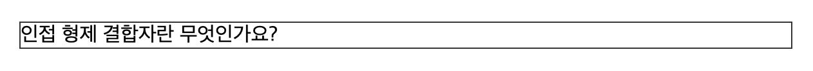
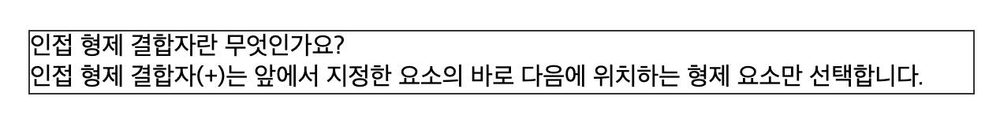

### pseudo-class (의사 클래스)

MDN Guide (https://developer.mozilla.org/ko/docs/Web/CSS/CSS_selectors)

---

### 설명

:checked CSS 의사 클래스 선택자는 선택했거나 on 상태인 라디오(<input type="radio">), 체크박스(<input type="checkbox">), 옵션(<option> 요소를 나타냅니다.

### 예제 1

```css
input:checked {
  border: 1px solid blue;
}
```

위 코드는 적용된 html 문서 중 모든 input 중 checked 상태인 input 요소에 1px 굵기의 solid 스타일 blue 테두리를 지정합니다.

<br>

```html
<div>
  <input type="checkbox" id="agree" />
  <label for="agree">Check me!</label>
</div>
```

사용자의 UX 를 높이기 위해 input 은 label 태그의 for 속성값과 연결되어 label의 텍스트를 클릭한 경우에도 체크박스가 동작하도록 기능을 제공하기도 합니다.

우리는 이제 input의 checked 속성을 사용해서 상태가 변화함에 따라 동적인 스타일링을 할 수 있습니다.

---

### 예제 2

```html
<div>
  <input type="checkbox" id="agree" />
  <label for="agree">약관에 동의하기</label>
</div>
```

예를 들어 약관에 동의하기 폼을 제공하는 화면이 있다고 생각해 봅시다.
html 구조는 위와 같고 우리는 input이 checked 상태일때 "약관에 동의하기" 글자를 bold 처리하고 싶습니다.

이런 문제를 해결하기 위해선 checked 상태가된 input 태그 다음에 등장하는 label 의 font-weight 속성을 컨트롤 해야합니다.

그렇다면, 요구사항을 한글로 정리한다면 어떻게 될까요? 위에서 설명한 내용 그대로

1. input type 이 checkbox 인 태그가 checked 상태인 경우 (조건)
2. input 태그에 인접한 (바로 뒤에 위치하는) label 태그의 font-weight 를 bold 처리한다.

로 문제를 정리 할 수 있습니다. 그럼 위에 정리한 내용을 css 로 번역해 볼까요?

```css
input:checked + label {
  font-weight: bold;
}
```

정답은 위 코드 처럼 인접 형제 결합자(+) 를 사용해서 풀이 할 수 있습니다.
첫 시간 selector 가이드에서 제공한 MDN 문서를 한번이라도 살펴보았다면 이런 단어를 본 기억이 있을거에요. 아래 링크를 남깁니다.

인접 형제 결합자(https://developer.mozilla.org/ko/docs/Web/CSS/Next-sibling_combinator)

<br>

---

### 문제 1

이런 상태를 사용해서 우리는 자바스크립트를 사용하지 않고 동적인 스타일링을 할 수 있습니다.
예를 들어 아코디언 UI 처럼 특정 텍스트를 포함한 지문을 클릭 했을때 아래 설명이 등장해야한다면
어떻게 해야 할까요?

그림으로 before - after 를 표현하면 아래와 같습니다.

[before]


[after]


🔎 html 구조 힌트

```html
<label for="title-1">인접 형제 결합자란 무엇인가요?</label>
<input type="checkbox" id="title-1" />
<div class="description">
  인접 형제 결합자(+)는 앞에서 지정한 요소의 바로 다음에 위치하는 형제 요소만
  선택합니다.
</div>
```
